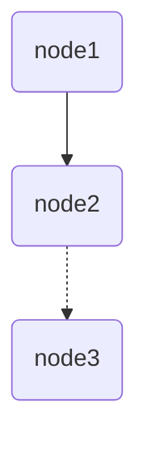

# easy-dag：Golang 实现的轻量级泛型 DAG 框架

## 🌟 核心特点
- **超级轻量**：极简设计，不依赖外部库
- **泛型数据总线**：节点间通过统一参数对象通信，基于 Go 泛型实现，类型安全
- **图定义复用**：支持一次构建 DAG 图结构，多次使用不同输入执行
- **零反射操作**：避免性能损耗，效率高效
- **简单易上手**：直观的 API 设计，快速构建工作流

## 📊 图能力
- **环形依赖检测**: 构建图时自动执行环形依赖检测，若发现环形依赖会立即抛出异常并附带完整环路径，帮助开发者在构建阶段快速定位循环依赖问题，避免运行时异常
- **支持可视化**：内置图结构可视化工具，可一键生成`mermaid`流程图代码。mermaid 代码可直接在 GitHub、VS Code、GoLand 等平台渲染
- **支持协程池**：集成协程池调度能力，可通过配置限制并发执行的协程数量。内置的协程池采用简单的 FIFO 策略，暂不支持优先级协程池

## 🚀 节点能力
支持为每个节点配置丰富的执行策略：
- **强依赖**：必须成功执行的前置节点
- **弱依赖**：失败不影响当前节点执行的前置节点
- **超时控制**：支持设置节点执行的本地时间限制与全局时间限制，本地时间限制从节点开始运行时开始计时，全局时间限制从图开始运行时开始计时
- **重试机制**：支持配置失败重试次数，在超时后不会继续发起重试
- **退避策略**：失败重试之间的等待时间的计算策略，提供线性退避、线性抖动退避、指数退避、指数抖动退避四种策略，支持自定义策略
- **钩子函数**：支持自定义节点成功、节点失败时的钩子函数

> ⚠️ 注意：超时时间包含重试和退避时间，因此不建议同时设置超时时间、重试次数和退避策略。

## ✅ 最佳实践
对配置了超时时间的节点，建议使用节点的`DoIfRunning`方法往数据总线写入数据。该方法仅在节点运行时（即未超时时）才执行操作，可有效避免超时重试导致的并发数据冲突，保障数据一致性。

## 💻 代码示例

```go
package main

import (
	"fmt"
	easydag "github.com/china-tjj/easy-dag"
	"time"
)

type Params struct {
	v1 int
	v2 int
	v3 int
}

func processor1(node easydag.IRuntimeNode, params *Params) error {
	params.v1 = 1
	fmt.Println("node1 success")
	return nil
}

func processor2(node easydag.IRuntimeNode, params *Params) error {
	// 模拟远程调用
	time.Sleep(2 * time.Millisecond)
	ok := node.DoIfRunning(func() {
		params.v2 = 10
	})
	if ok {
		fmt.Println("node2 success")
	} else {
		fmt.Println("node2 timeout")
	}
	return nil
}

func processor3(node easydag.IRuntimeNode, params *Params) error {
	params.v3 = params.v1 + params.v2
	fmt.Println("node3 success")
	return nil
}

func main() {
	node1 := &easydag.Node[*Params]{
		Name:      "node1",
		Processor: processor1,
	}
	node2 := &easydag.Node[*Params]{
		Name:         "node2",
		LocalTimeout: 1 * time.Millisecond,
		Processor:    processor2,
		Dependencies: []*easydag.Node[*Params]{node1},
	}
	node3 := &easydag.Node[*Params]{
		Name:             "node3",
		Processor:        processor3,
		WeakDependencies: []*easydag.Node[*Params]{node2},
	}
	dag, err := easydag.NewDAG(node3)
	if err != nil {
		panic(err)
	}
	err = dag.SaveAsMermaid("./example/example.mermaid")
	if err != nil {
		panic(err)
	}
	params := &Params{}
	dag.Run(params)
	fmt.Printf("%+v\n", params)
}

```
### 运行结果
```text
node1 success
node3 success
&{v1:1 v2:0 v3:1}
```

### 可视化结果


## 📌 核心概念说明
- **IRuntimeNode**：节点运行时对外暴露的接口，可以获取节点相关信息，在超时前安全的执行自定义函数等
- **Node**：节点定义结构体，包含处理器、依赖关系、执行策略等配置
- **DAG**：有向无环图，负责调度节点执行顺序和生命周期，支持一次构建多次运行

通过以上设计，easy-dag 实现了一个高效、易用的泛型DAG框架，适用于需要按依赖关系调度任务的场景
